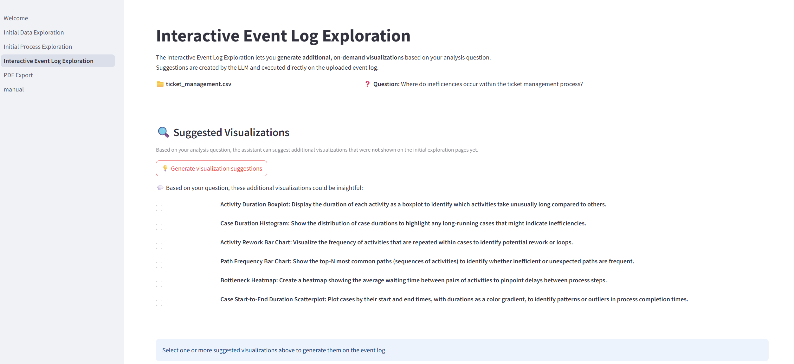
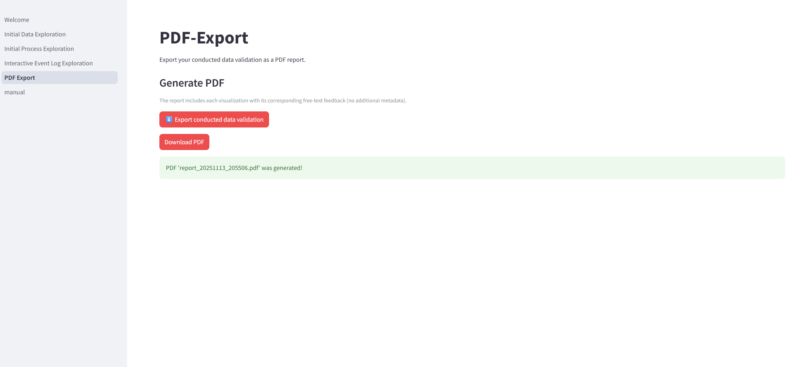
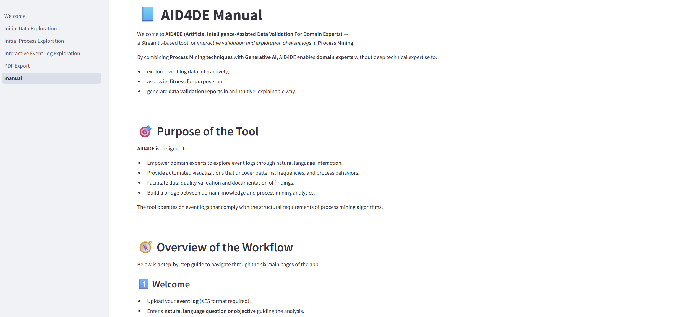

# AI-assisted Data Validation for Domain Experts (AID4DE)
## Overview
This project provides *AID4DE*, a tool for interactive data validation of event logs in the field of Process Mining. By leveraging Generative AI, it empowers domain experts to explore event log data and establish a foundation for evaluating its fitness for purpose.

On the welcome page, an XES event log, which fulfills the structural requirements to be parsed by Process Mining algorithms, and relevant analysis questions can be uploaded.


The initial data exploration page facilitates the generation of a preliminary understanding of the event log through a set of predefined visualizations.


The initial process exploration page enables a detailed examination of process-centric visualizations, allowing adjustment of the variant coverage threshold to refine the analysis.


The interactive event log exploration page recommends and generates additional potentially insightful visual representations aimed at assessing the validity of the event log.



The PDF export page compiles all generated visualizations and their associated user feedback into a structured, ready-to-download report that consolidates insights from the entire validation activity.



The manual page provides an overview of the tool’s functionality and purpose.



## Table of Contents
- [Introduction](#introduction)
- [Clone the repository](#clone-the-repository)
- [Set up a virtual environment](#set-up-a-virtual-environment)
- [Install requirements](#install-requirements)
- [Configure environment variables](#configure-environment-variables)
- [Usage](#usage)
  - [Starting the tool](#starting-the-tool)
  - [Uploading event log data](#uploading-event-log-data)
  - [Uploading analysis question](#uploading-analysis-question)
- [File descriptions](#file-descriptions)
- [License](#license)
- [Notes](#notes)

## Introduction 
*AID4DE* requires an event log dataset and an analysis question as input. Follow the steps below to get started.

## Clone the repository
Clone the repository to work with the code locally by using the following command:

```bash
git clone https://github.com/jul-dor/AID4DE.git
cd repo
```

## Set up a virtual environment
Set up a virtual environment (optional but recommended) to keep your project isolated, reproducible, and clean by using the following command:

```bash
# Create a virtual environment (name: .venv)
python -m venv .venv

# For macOS/Linux:
source .venv/bin/activate

# For Windows: 
.venv\Scripts\activate
```

## Install requirements
Install the following requirements to ensure that the code runs without errors:

```bash
pip install -r requirements.txt
```

## Configure environment variables
This project uses a `.env` file to store environment variables such as the API key for the LLM.  
A template file is provided as `.env.template`. To get started:

```bash
# For macOS/Linux:
cp .env.template .env  

# For Windows
copy .env.template .env
```

Then edit `.env` and add your values:

```env
API_KEY=your_real_api_key_here
```

## Usage
### Starting the tool
The tool is build with [Streamlit](https://streamlit.io). Run the Streamlit app locally, using the following command:

```bash
streamlit run 1_Welcome.py
```

### Uploading event log data 
You can upload XES event logs in `.xes` or `.csv` format. You can use the following dataset: Dataset belonging to the help desk log of an Italian Company (https://data.4tu.nl/articles/_/12675977/1).

If you want to use a different dataset you have to specify the following variables within `1_Welcome.py`: `case_id_key`, `activity_key`, `timestamp_key`, and `resource_key`. 

Please note that larger datasets will take longer computation time as an LLM needs to process the representational semantics of the corresponding event log. 

### Uploading analysis question
Dependent on your Process Mining project you can state different analysis questions. For trying out the prototype, the following analysis questions can serve as an inspiration:

1. Control-Flow Analysis:
  - Where do inefficiencies occur within the prevailing process?
  - What are the most common variants in the process?
  - How does the process evolve over time?
2. Performance Analysis:
  - Where do delays and waiting times accumulate most significantly across cases?
  - How does resource availability impact the overall throughput and cycle time?
  - Which parts of the process present the biggest opportunities for optimization?
3. Resource Analysis:
  - How do collaboration patterns and handoffs between roles or teams influence process performance?
  - Are there bottlenecks caused by resource overload or uneven workload distribution?
  - Which roles or departments have the greatest impact on process outcomes and quality?

## File descriptions
- `images/`: Contains snippets from the interfaces of the prototype.
  - `initial_data_exploration_page.png`: Shows the Initial Data Exploration page.
  - `initial_process_exploration_page.png`: Shows the Initial Process Exploration page.
  - `interactive_event_log_exploration_page.png`: Shows the Interactive Event Log Exploration page.
  - `manual_page.png`: Shows the Manual page.
  - `pdf_export_page.png`: Shows the PDF Export page.
  - `welcome_page.png`: Shows the Welcome page of *AID4DE*.
- `pages/`: Contains python scripts reflecting the pages witin interactive data validation.
  - `2_Initial_Data_Exploration.py`: Analysis of the uploaded event log through automatically generated visualizations.
  - `3_Initial_Process_Exploration.py`: Analysis of the uploaded event log from a process-centric perspective.
  - `4_Interactive_Event_Log_Exploration.py`: On-demand generation of further visualizations of the event log.
  - `5_PDF_Export.py`: Generation of a summary report about the conducted data validation. 
  - `manual.py`: Provision of background information about the tool.
- `utils/`: Support scripts for interactive data validation
  - `export.py`: Handles the assembly and generation of the final PDF report, combining visualizations and user feedback into a structured document.
  - `interactive_exploration.py`: Orchestrates LLM-driven suggestions and dynamic creation of additional visualizations based on user-defined analysis questions.
  - `media.py`: Manages the registration, formatting, and conversion of images and tables for display in Streamlit and inclusion in the PDF report.
  - `process_exploration.py`: Provides functions for process-centric analysis, including BPMN discovery, DECLARE modeling, footprint generation, and extraction of representational semantics.
  - `state.py`: Maintains and organizes session state, including extracted representational semantics, feedback entries, and export-ready content across all pages.
  - `visualize_data`: Generates predefined event-log visualizations and extracts the corresponding representational semantics to support both interactive exploration and LLM context building.
- `.env.template`: Listing the environment variables required by the provided tool.
- `.gitignore`: Configuration file that tells Git which files or directories to ignore and exclude from version control. 
- `1_Welcome.py`: Welcomes the domain expert and enables upload of event log and analysis question.
- `LICENSES.md`: License file (MIT).
- `README.md`: This file. Contains an overview of the project.
- `requirements.txt`: Lists the required Python packages.

## License
See the [LICENSE](LICENSE.md) file for license rights and limitations (MIT).

## Notes

### Environment Variables
- Do **not** commit your `.env` file – it is excluded via `.gitignore` for security reasons.
- A **`.env.template`** file is provided as a reference to indicate which environment variables must be configured (e.g., Azure OpenAI credentials).
- Ensure that **all required environment variables** are properly set before starting the application.

### Dependencies & Setup
- The application relies on **pm4py** and **Graphviz** for process mining visualizations.  
  Make sure that **Graphviz is installed system-wide** and available on your system’s `PATH`.
- For a clean and reproducible setup, create a **fresh virtual environment** and install dependencies using:
  ```bash
  pip install -r requirements.txt