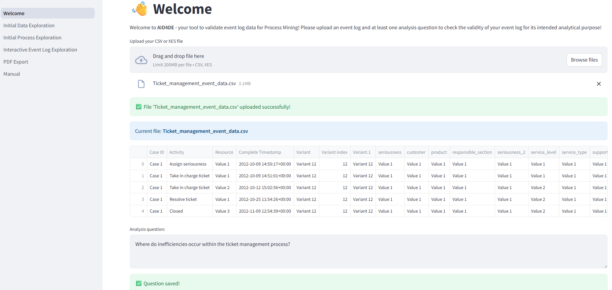
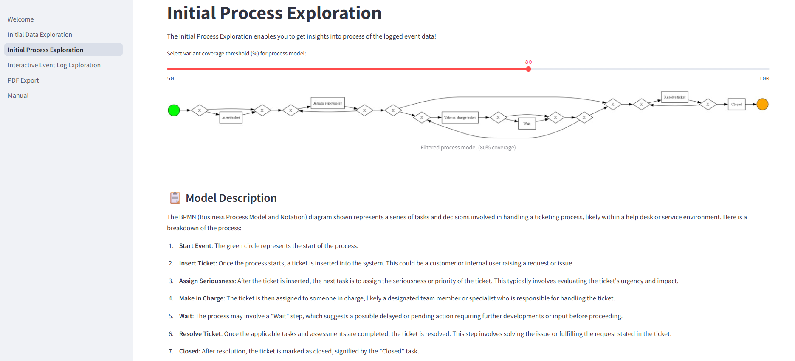

# AI-assisted Data Validation for Domain Experts (AID4DE)
## Overview
This project provides *AID4DE*, a tool for interactive data validation of event logs in the field of Process Mining. By leveraging Generative AI, it empowers domain experts to explore event log data and establish a foundation for evaluating its fitness for purpose.

On the welcome page, an XES event log, which fulfills the structural requirements to be parsed by Process Mining algorithms, and relevant analysis questions can be uploaded.


The initial data exploration page facilitates the generation of a preliminary understanding of the event log through a set of predefined visualizations.


The initial process exploration page enables a detailed examination of process-centric visualizations, allowing adjustment of the variant coverage threshold to refine the analysis.


The interactive event log exploration page recommends additional potentially insightful visual representations aimed at assessing the validity of the event log.


## Table of Contents
- [Introduction](#introduction)
- [Clone the repository](#clone-the-repository)
- [Set up a virtual environment](#set-up-a-virtual-environment)
- [Install requirements](#install-requirements)
- [Configure environment variables](#configure-environment-variables)
- [Usage](#usage)
  - [Starting the tool](#starting-the-tool)
  - [Uploading event log data](#uploading-event-log-data)
  - [Uploading analysis question](#uploading-analysis-question)
- [File descriptions](#file-descriptions)
- [License](#license)
- [Notes](#notes)

## Introduction 
*AID4DE* requires an event log dataset and an analysis question as input. Follow the steps below to get started.

## Clone the repository
Clone the repository to work with the code locally by using the following command:

```bash
git clone https://github.com/jul-dor/AID4DE.git
cd repo
```

## Set up a virtual environment
Set up a virtual environment (optional but recommended) to keep your project isolated, reproducible, and clean by using the following command:

```bash
# Create a virtual environment (name: .venv)
python -m venv .venv

# For macOS/Linux:
source .venv/bin/activate

# For Windows: 
.venv\Scripts\activate
```

## Install requirements
Install the following requirements to ensure that the code runs without errors:

```bash
pip install -r requirements.txt
```

## Configure environment variables
This project uses a `.env` file to store environment variables such as the API key for the LLM.  
A template file is provided as `.env.template`. To get started:

```bash
# For macOS/Linux:
cp .env.template .env  

# For Windows
copy .env.template .env
```

Then edit `.env` and add your values:

```env
API_KEY=your_real_api_key_here
```

## Usage
### Starting the tool
The tool is build with [Streamlit](https://streamlit.io). Run the Streamlit app locally, using the following command:

```bash
streamlit run 1_Welcome.py
```

### Uploading event log data 
You can upload XES event logs in `.xes` or `.csv` format. You can use the following dataset: Dataset belonging to the help desk log of an Italian Company (https://data.4tu.nl/articles/_/12675977/1).

If you want to use a different dataset you have to specify the following variables within `1_Welcome.py`: `case_id_key`, `activity_key`, `timestamp_key`, and `resource_key`. 

Please note that larger datasets will take longer computation time as an LLM needs to process the representational semantics of the corresponding event log. 

### Uploading analysis question
Dependent on your Process Mining project you can state different analysis questions. For trying out the prototype, the following analysis questions can serve as an inspiration:

1. Control-Flow Analysis:
  - Where do inefficiencies occur within the prevailing process?
  - What are the most common variants in the process?
  - How does the process evolve over time?
2. Performance Analysis:
  - Where do delays and waiting times accumulate most significantly across cases?
  - How does resource availability impact the overall throughput and cycle time?
  - Which parts of the process present the biggest opportunities for optimization?
3. Resource Analysis:
  - How do collaboration patterns and handoffs between roles or teams influence process performance?
  - Are there bottlenecks caused by resource overload or uneven workload distribution?
  - Which roles or departments have the greatest impact on process outcomes and quality?

## File descriptions
- `pages/`: Contains python scripts reflecting the pages witin interactive data validation.
  - `2_Data_Exploration.py`: Analysis of the uploaded event log through automatically generated visualizations.
  - `3_Discovery.py`: Analysis of the uploaded event log from a process-centric perspective.
  - `4_Interactive_Plot_Generation.py`: On-demand generation of further visualizations of the event log.
  - `5_ Outlier_Analysis.py`: Analysis of outliers within the event log.
  - `6_PDF_Export.py`: Generation of a summary report about the conducted data validation. 
  - `manual.py`: Provision of background information about the tool.
- `utils/`: Support scripts for interactive data validation
  - `visualize_data`: Functions for the generation of visualizations and the extraction of representational semantics of the event log.
- `.env.template`: Listing the environment variables required by the provided tool.
- `.gitignore`: Configuration file that tells Git which files or directories to ignore and exclude from version control. 
- `1_Welcome.py`: Welcomes the domain expert and enables upload of event log and analysis question.
- `LICENSES.md`: License file (MIT).
- `README.md`: This file. Contains an overview of the project.

## License
See the [LICENSE](LICENSE.md) file for license rights and limitations (MIT).

## Notes
- Do **not** commit your `.env` file – it's excluded via `.gitignore`.
- A `.env.template` file is provided to help others understand what variables they need to set.